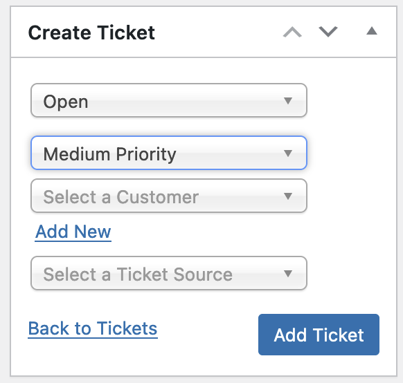
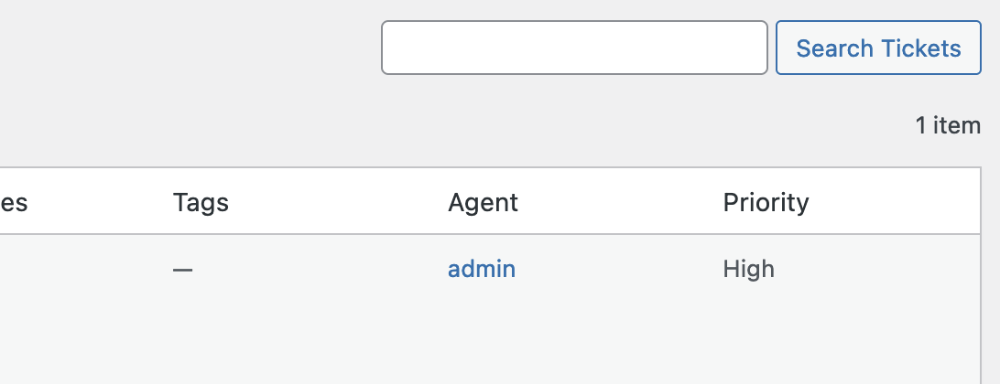
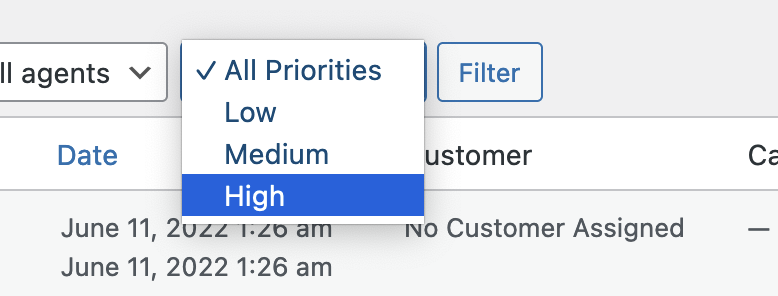

   

# Ticket Priorities for KB Support

Adds a priority field for [KB Support](https://wordpress.org/plugins/kb-support/), WordPress ticketing system.

* Displays a dropdown on the ticket edit screen to change the priority.

 
* Displays a column in the ticket list showing each ticket's priority.
  

* Adds a filter on the ticket list table to show e.g. only high priority tickets.

`wp post list --post_type=kbs_ticket --ticket_priority=high`
 
* TODO: Tickets not created/saved in the admin UI probably won't filter properly in the list table.
* TODO: Log when the ticket priority changes.

## See:

* [KB Support WordPress plugin on WordPress.org](https://wordpress.org/plugins/kb-support/)
* [KB Support on GitHub](https://github.com/WPChill/kb-support)